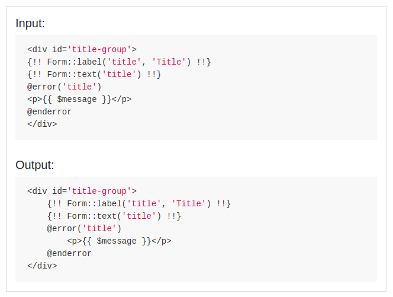

# Basic indenter for Laravel 5.8+ Blade templates

This is a very simple indenter for Laravel Blade template, mainly designed to indent generated files in my [CRUD generator for Laravel](https://github.com/bgaze/laravel-crud).

It won't format or validate code: it just indent existing lines following very simple rules.  
It expects a valid and well formed code, and won't deal well with instructions on multiple lines.

Any contribution or feedback is highly welcomed, please feel free to create a pull request or [submit a new issue](https://github.com/bgaze/laravel-blade-indenter/issues/new).

<p>
    
</p>

## Documentation

Full documentation is available at [https://packages.bgaze.fr/laravel-blade-indenter](https://packages.bgaze.fr/laravel-blade-indenter)

## Quick start

Simply import the package with composer:

```
composer require bgaze/laravel-blade-indenter
```

Configuration can be published to `/config/blade-indenter.php`:

```
php artisan vendor:publish --tag=blade-indenter-config
```

The package exposes a single service which indents Blade string :

```php
use Bgaze\BladeIndenter\BladeIndenter;

$indentedString = resolve(BladeIndenter::class)->indent($stringToIndent);
```

Two helpers are also provided for convenience :

```php
// Indent a string
$indentedString = indent_blade_string($stringToIndent);

// Indent a blade file, overwrite it and return formatted content.
$indentedFileContent = indent_blade_file($filePath);

// Indent a blade file and return formatted content without overwriting.
$indentedFileContent = indent_blade_file($filePath, false);
```
